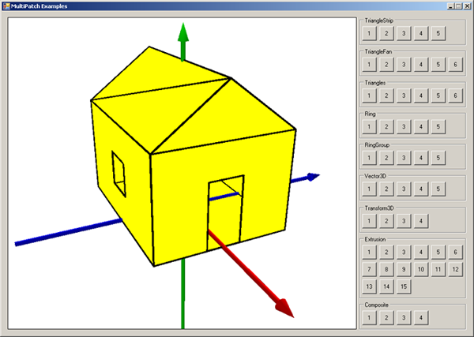

##3D multipatch examples

###Purpose  
This sample shows how various multipatch geometries can be programmatically constructed—alone, from a single patch (TriangleStrip, TriangleFan, Triangles, and Ring examples), from a series of Rings (RingGroup examples), through the assistance of the Vector3D class (Vector3D examples), via extrusion of base 2D geometries (Extrusion examples), and from multiple patches of varying types (Composite examples). Examples have also been provided showing how these geometries can be rotated, scaled, and repositioned via the ITransform3D interface. By studying these examples, a user can gain insight into the types of shapes the multipatch geometry type can encompass and identify cases where it is appropriate to use, to model 3D entities in a geographic information system (GIS).   

###Usage
####Running the sample  
1. Start Visual Studio.  
1. Click Debug and click Start Debugging, or compile the sample and run the created .exe file.   

####Using the sample  
1. When the sample starts, you will see x-, y-, z-axes rendered in an embedded SceneControl and buttons on the right side of the form.   
1. Click a button on the right side of the Windows form's user interface (UI) to render the selected example in the embedded SceneControl with the x-, y-, z-axes (left in place to clarify where the multipatch is positioned in 3D space). The geometry is rendered with a solid fill color and the outline that makes up the multipatch geometry is rendered for illustrative purposes.  
1. The header for the sections of buttons indicates the type of geometry that is rendered, and each of the numbered buttons corresponds to a different example of that type of geometry. For example, clicking the 1 button on the Composite section shows two cylinders and two pyramids. Clicking the 3 button on the Composite section results in the house shown in the following illustration. Each click clears the screen allowing the recently clicked item to appear.   
1. To rotate the displayed multipatch, click and drag the SceneControl. Move left and right to move around in the same horizontal plane, and move the mouse pointer up and down to rotate vertically.  
1. To zoom out, right-click and hold down the mouse button while moving the mouse pointer away from you.   
1. To zoom in, right-click and hold down the mouse button while moving the mouse pointer towards you. See the following illustration:  

  
Illustration showing multipatch example UI after adding geometries.  

####Additional information  

If you are working in a 2D environment, the code to create the multipatch items are the same. Write your class to draw them, as the one used in this example draws in 3D. If you are working in 2D with these multipoint items, no extension (neither 3D Analyst for ArcGIS for Desktop Basic, ArcGIS for Desktop Standard, and ArcGIS for Desktop, nor 3D for ArcGIS Engine) is required. 
  

####See Also  
[How to create a multipatch using a series of triangles](http://desktop.arcgis.com/search/?q=How%20to%20create%20a%20multipatch%20using%20a%20series%20of%20triangles&p=0&language=en&product=arcobjects-sdk-dotnet&version=&n=15&collection=help)  

---------------------------------

####Licensing  
| Development licensing | Deployment licensing | 
| :------------- | :------------- | 
| Engine Developer Kit | ArcGIS for Desktop Basic: 3D Analyst |  
|  | ArcGIS for Desktop Standard: 3D Analyst |  
|  | ArcGIS for Desktop Advanced: 3D Analyst |  
|  | Engine: 3D Analyst |  

