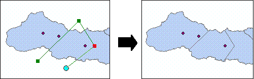

##Cut polygons without selection edit task

###Purpose  
This sample illustrates how to create a custom ArcGIS Engine edit task that can be used in conjunction with the out-of-the-box editing commands. The Cut Polygons Without Selection edit task allows the user to cut features in a polygon layer using the Sketch tool without requiring a selection.  

###Usage
1. Build and run the sample.   
1. Start editing.  
1. Zoom in polygon features to cut.  
1. Click the Cut Polygons Without Selection task.  
1. Click the Sketch tool.  
1. Cut a polygon (or polygons) in two or more places with the Sketch tool.  
1. Finish the sketch to perform the cut.  
1. Stop editing. See the following illustration:  

  
Illustration using the edit task to split a feature without selecting it.  

####Additional information  

The edit task is created by implementing the IEngineEditTask interface. Compiling this sample registers the edit task in the ESRI Engine Edit Tasks component category which is used to populate the ControlsEditingTaskToolControl at runtime.  
  

 
  

The position of the task in the ControlsEditingTaskToolControl list is controlled using the IEngineEditTask.GroupName property and the display name using the IEngineEditTask.Name property.
  

 
  

The IEngineEditTask.Activate method is called when the end user selects the edit task in the ControlsEditingTaskToolControl. The Activate method is used to set up listeners to the following IEngineEditEvents: 
  

   These event listeners set the IEngineEditSketch.GeometryType to null if the target layer does not have a polygon geometry type, thereby disabling the Sketch tool.
  

 
  

The IEngineEditTask.OnFinishSketch method is used to cut the intersected features using the IFeatureEdit.Split method, passing in the geometry from the digitized sketch as an argument. Edits to features are made in a single edit operation and added to the operation stack.  
  

---------------------------------

####Licensing  
| Development licensing | Deployment licensing | 
| :------------- | :------------- | 
| Engine Developer Kit | ArcGIS for Desktop Basic |  
|  | ArcGIS for Desktop Standard |  
|  | ArcGIS for Desktop Advanced |  
|  | Engine |  

