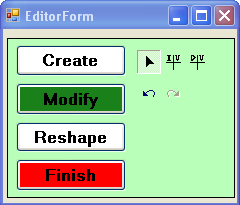

##Editing using a custom form

###Purpose  
This sample demonstrates how to hide the complexity of editing in an ArcGIS Engine application by presenting a simple editing interface to users. It also shows how to impose business rules on the editing process by listening to ArcGIS Engine edit events.   

###Usage
1. Compile and run the sample.  
1. Click the launch editor form command (blue square, white E).  
1. Click Edit on the EditorForm to start editing the Highways layer.  
1. On the EditorForm, try the Create, Modify, and Reshape tools.  
1. Perform an action to intersect a lake, for example, digitize a new road through a lake (the application should not allow you to do this).  
1. Try the undo and redo functionality.  
1. Click Finish to stop editing (save or discard edits). See the following screen shot:  

  
Screen shot of the EditorForm used to edit the Highways layer.  

####Additional information  

Applications that allow users to edit data often attempt to simplify the editing process and maintain data integrity through business rules. The following shows how this sample achieves this in an ArcGIS Engine application:
  

 
  

  <strong>Presenting a simple UI for editing</strong>

  

The MainForm form provides viewing capabilities for the application and the EditorForm (shown in the previous screen shot) presents a simple UI dedicated to editing the Highways layer.  
  

 
  

To start an edit session, click the E command (EditCmd) on the MainForm, then click Edit in the EditorForm. The target layer is set to Highways using the IEngineEditLayers.SetTargetLayer method. Clicking one of the editing buttons (Create, Modify, and Reshape) adds an appropriate ToolbarControl to the flowLayoutPanel1 and sets the edit task using the IEngineEditor.CurrentTask property. Each ToolbarControl contains out-of-the-box editing commands or sample commands.  
  

 
  

  <strong>Buddying controls hosted on separate forms</strong>

  

Buddying the ToolbarControls hosted on the EditorForm with the axMapControl1 on the MainForm has been achieved through the use of the EditHelper class.
  

 
  

  <strong>Imposing business rules on the editing process</strong>

  

The EditorForm listens to the IEngineEditEvents.OnSketchModified event to check whether an  edit is valid or invalid. A spatial query is performed in the IsHighWaysEditValid function to determine whether the highway feature being edited intersects the Lakes layer. If the function returns false, the edit is rolled back by calling the IOperationStack.Undo method—an Invalid Edit warning appears on the EditorForm.
  

####See Also  
[Sample: Custom reshape polyline edit task](../../../Net/Controls/EditingReshapePolylineEditTask)  
[Sample: Custom vertex editing commands](../../../Net/Controls/EditingVertexCommands)  

---------------------------------

####Licensing  
| Development licensing | Deployment licensing | 
| :------------- | :------------- | 
| Engine Developer Kit | Engine |  
|  | ArcGIS for Desktop Basic |  
|  | ArcGIS for Desktop Standard |  
|  | ArcGIS for Desktop Advanced |  

