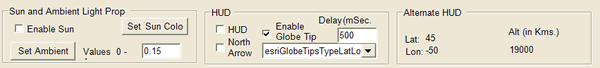

##Effects in the GlobeControl

###Purpose  
This sample demonstrates how to manipulate heads-up display (HUD), north arrow, observer location (latitude, longitude, and altitude), enabling, setting sun, and ambient light effects. This sample shows how to do the following:Use the IGlobeViewer interface NorthArrowEnabled and HUDEnabled properties to enable north arrow and heads-up display.Use the IGlobeDisplayRendering interface GetSunColor, SetSunColor, GetSunPosition, and SetSunPosition methods and AmbientLight property to get and set the sun color, sun position, and ambient light.Use the IGlobeCamera.GetObserverLatLonAlt method to get observer latitude, longitude, and altitude.Listen to an AfterDraw event of IGlobeDisplayEvents.  

###Usage
1. If no default document is loaded, open a globe document.  
1. Select the Enable Sun check box to enable and disable the sun effect and click the Set Sun Color button to set the desired color of the sun.   
1. Select the HUD check boxes to enable and disable the built-in heads-up display; the Alternate HUD area shows how to make a heads-up display.   

  
Screen shot of the HUD options used in this sample.  

####See Also  
[GlobeControl class](http://desktop.arcgis.com/search/?q=GlobeControl%20class&p=0&language=en&product=arcobjects-sdk-dotnet&version=&n=15&collection=help)  
[IGlobeControl interface](http://desktop.arcgis.com/search/?q=IGlobeControl%20interface&p=0&language=en&product=arcobjects-sdk-dotnet&version=&n=15&collection=help)  

---------------------------------

####Licensing  
| Development licensing | Deployment licensing | 
| :------------- | :------------- | 
| Engine Developer Kit | Engine: 3D Analyst |  
|  | ArcGIS for Desktop Basic: 3D Analyst |  
|  | ArcGIS for Desktop Standard: 3D Analyst |  
|  | ArcGIS for Desktop Advanced: 3D Analyst |  

