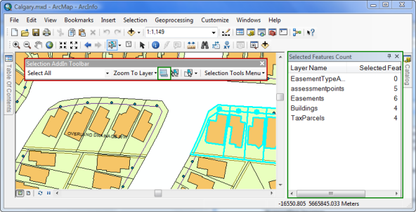

## Custom selection extension

  <div xmlns="http://www.w3.org/1999/xhtml" xmlns:my="http://schemas.microsoft.com/office/infopath/2003/myXSD/2006-02-10T23:25:53">This sample demonstrates how to create a complete add-in. The sample is based around a selection theme but its purpose is to demonstrate multiple add-in components working together. This add-in contains an extension, a dockview, a toolbar with several buttons and tools, and a menu. All components are disabled until the extension is selected on the Extensions dialog box. The extension does not load until it needs to (it delay loads). Similarly, the dockview only gets created once the Toggle DockView button is clicked. </div>
  <div xmlns="http://www.w3.org/1999/xhtml" xmlns:my="http://schemas.microsoft.com/office/infopath/2003/myXSD/2006-02-10T23:25:53"> </div>
  <div xmlns="http://www.w3.org/1999/xhtml" xmlns:my="http://schemas.microsoft.com/office/infopath/2003/myXSD/2006-02-10T23:25:53">This sample has also been localized to Chinese(PRC).</div>  


<!-- TODO: Fill this section below with metadata about this sample-->
```
Language:              C#, VB
Subject:               Framework
Organization:          Esri, http://www.esri.com
Date:                  3/24/2017
ArcObjects SDK:        10.5
Visual Studio:         2013, 2015
.NET Target Framework: 4.5
```

### Resources

* [ArcObjects .NET API Reference online](http://desktop.arcgis.com/en/arcobjects/latest/net/webframe.htm)  
* [Sample Data Download](../../releases)  
* [What's new](http://desktop.arcgis.com/en/arcobjects/latest/net/webframe.htm#05247c04-bfd9-4e36-ae09-bc6e833c3b14.htm)  
* [Download the ArcObjects SDK for .Net from MyEsri.com](https://my.esri.com/)  

### Usage
1. In Visual Studio, click the Build menu and click Build Solution.  
1. Load some data in ArcMap.  
1. Click the Customize menu, click Toolbars, then choose the Selection Add-In toolbar. (See the second screen shot for the Selection AddIn toolbar.)  
1. Click the Customize menu and click Extensions. Select the Selection Sample Extension check box on the Extensions dialog box. (See the first screen shot.)  
1. Make a selection using one of the tools.  
1. Optionally, use the combo box to choose target selection layers.  
1. Optionally, click the Zoom to layer menu to zoom to a selected layer.  
1. The dockable window will report selected features count. (See the second screen shot for the highlighted dockable window.)  
1. Use the toggle button to toggle the dockable window. The button is highlighted in a yellow box on the second screen shot.  
1. To see the localized version, change the format to Chinese(PRC) on the Regional and Language Options dialog box (accessed from the Control Panel).  


  
Screen shot of the Extensions dialog box.  
  
Screen shot of ArcMap showing the custom toolbar and dockable window.  


---------------------------------

#### Licensing  
| Development licensing | Deployment licensing | 
| ------------- | ------------- | 
| ArcGIS Desktop Basic | ArcGIS Desktop Basic |  
| ArcGIS Desktop Standard | ArcGIS Desktop Standard |  
| ArcGIS Desktop Advanced | ArcGIS Desktop Advanced |  


