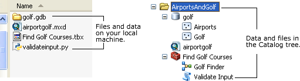

## Consuming a geoprocessing custom model in .NET

  <div xmlns="http://www.w3.org/1999/xhtml" xmlns:my="http://schemas.microsoft.com/office/infopath/2003/myXSD/2006-02-10T23:25:53">This sample shows how to consume a custom geoprocessing model in a .NET Visual Studio console project. This sample accompanies the [Consuming a geoprocessing model tool in .NET](http://6015005b-85ad-4e45-b0cf-cf59bfaec915/) walkthrough topic. </div>  


<!-- TODO: Fill this section below with metadata about this sample-->
```
Language:              C#, VB
Subject:               Geoprocessing
Organization:          Esri, http://www.esri.com
Date:                  3/24/2017
ArcObjects SDK:        10.5
Visual Studio:         2013, 2015
.NET Target Framework: 4.5
```

### Resources

* [ArcObjects .NET API Reference online](http://desktop.arcgis.com/en/arcobjects/latest/net/webframe.htm)  
* [Sample Data Download](../../releases)  
* [What's new](http://desktop.arcgis.com/en/arcobjects/latest/net/webframe.htm#05247c04-bfd9-4e36-ae09-bc6e833c3b14.htm)  
* [Download the ArcObjects SDK for .Net from MyEsri.com](https://my.esri.com/)  

### Usage
#### Data preparation  
1. Create a directory on your local machine to copy the test data and files. For example, create gp under the C:\ drive in which case your files and data will be in C:\gp\AirportsAndGolf directory. You can, however, create the folder anywhere as the program prompts you to type the path in the command line.  
1. Copy the AirportsAndGolf folder from the <ArcGIS Developer Kit installation location>\Samples\data folder to the directory you created in Step 1. The following files show in the file view—golf.gdb (geodatabase), airportgolf.mxd (map document), Find Golf Courses.tbx (toolbox), and validateinput.py (Python file). See the following screen shot that shows the data and files on the local drive and in the Catalog tree:   

#### Test the .NET solution  
1. Open the solution file in the CSharp or VBNet folder for this sample.   
1. Compile and run the solution.   
1. On the console window, type the data's full path, then press Enter.   


  
Screen shot showing data and files on the local drive and in the Catalog tree.  


#### See Also  
[Walkthrough: Consuming a geoprocessing model tool in .NET](http://desktop.arcgis.com/search/?q=Walkthrough%3A%20Consuming%20a%20geoprocessing%20model%20tool%20in%20.NET&p=0&language=en&product=arcobjects-sdk-dotnet&version=&n=15&collection=help)  


---------------------------------

#### Licensing  
| Development licensing | Deployment licensing | 
| ------------- | ------------- | 
| ArcGIS Desktop Basic | ArcGIS Desktop Basic |  
| ArcGIS Desktop Standard | ArcGIS Desktop Standard |  
| ArcGIS Desktop Advanced | ArcGIS Desktop Advanced |  
| Engine Developer Kit | Engine |  


