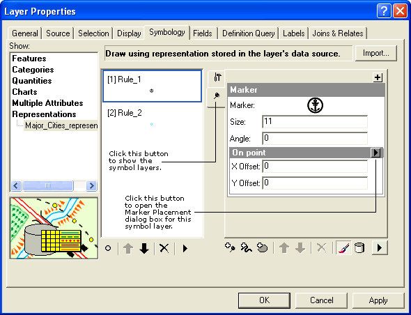

## Create a custom marker placement for placing markers around a point

  <div xmlns="http://www.w3.org/1999/xhtml">This sample shows how a custom marker placement can be created. The marker placement puts markers around a point. The placement of markers can be controlled using number of markers and the radius, which are exposed as graphic attributes. </div>
  <div xmlns="http://www.w3.org/1999/xhtml"> </div>
  <div xmlns="http://www.w3.org/1999/xhtml">The sample lists implementation of IGraphicAttributes, IMarkerPlacement, and IPersistVariant interfaces and also shows how the custom class should be registered by ESRI Representation Marker Placement Component Category. </div>  


<!-- TODO: Fill this section below with metadata about this sample-->
```
Language:              C#, VB
Subject:               Map
Organization:          Esri, http://www.esri.com
Date:                  11/17/2017
ArcObjects SDK:        10.6
Visual Studio:         2015, 2017
.NET Target Framework: 4.5
```

### Resources

* [ArcObjects .NET API Reference online](http://desktop.arcgis.com/en/arcobjects/latest/net/webframe.htm)  
* [Sample Data Download](../../releases)  
* [What's new](http://desktop.arcgis.com/en/arcobjects/latest/net/webframe.htm#05247c04-bfd9-4e36-ae09-bc6e833c3b14.htm)  
* [Download the ArcObjects SDK for .Net from MyEsri.com](https://my.esri.com/)  

### Usage
1. Open the Visual Studio solution file.  
1. Build the solution.  
1. Open ArcMap, then a map document.  
1. Click the Add Data button to add a point feature class with representations to the map document.   
1. In the Layer Properties dialog box, click the Symbology tab to change the feature renderer to a representation renderer.   
1. Select the representation rule within the representation renderer that you want to add this custom marker placement to.   
1. Select a basic marker symbol in this representation rule or add a new basic marker symbol.   
1. Click the arrow button next to your selected marker symbol layer to open the Marker Placement dialog box, which lists all marker placements. The custom class will be listed under the point input options. Select the Around_Point option.  
1. Select the new custom marker placement to put new marker symbols around the point geometry. Change the values for radius and number or accept the default values.   


  
The Layer Properties dialog box highlighting buttons used in this sample.   


---------------------------------

#### Licensing  
| Development licensing | Deployment licensing | 
| ------------- | ------------- | 
| ArcGIS Desktop Basic | ArcGIS Desktop Basic |  
| ArcGIS Desktop Standard | ArcGIS Desktop Standard |  
| ArcGIS Desktop Advanced | ArcGIS Desktop Advanced |  


